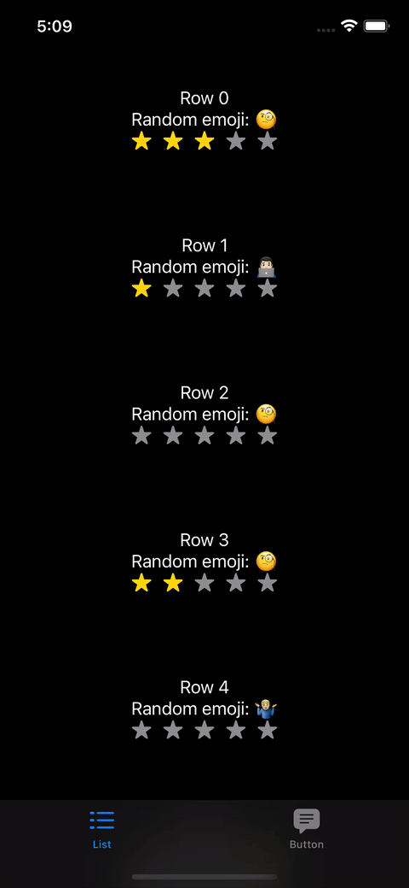

# PopoverPresenter

<p align="center">
    
    
    
</p>

👨🏻‍💻 Feel free to subscribe to channel **[SwiftUI dev](https://t.me/swiftui_dev)** in telegram.

Demo project with tutorial how to customize alerts or popovers in SwiftUI based on [this article](https://medium.com/@ihamadfuad/swiftui-present-sheet-from-anywhere-using-environment-6104b2bd7d4e).

Before starting highly recommended to read [SwiftUI Custom Environment Values](https://useyourloaf.com/blog/swiftui-custom-environment-values/).

<p align="center">

</p>

## Installation

To use PopoverPresenter with a project targeting iOS 13, simply copy folder `Source` into your project.

#### Swift Package Manager

To integrate PopoverPresenter into your project using SwiftPM add the following to your `Package.swift`:

```swift
dependencies: [
    .package(url: "https://github.com/c-villain/PopoverPresenter", from: "0.1.0"),
],
```

## Quick start

1. Import library to your root-file view:
```swift
import PopoverPresenter
```
2. Init instance in root view:
```swift
@StateObject var popoverPresenter = PopoverPresenter()
```
3. Add modifier to root-object view:
```swift
.environment(\.popoverPresenterKey, popoverPresenter)
.customPopover(item: $popoverPresenter.activePopover) { popover in
    switch popover {
    default:
        popoverPresenter.currentPopover
    }
}
```
4. In child view create link to environment key:
```swift
@Environment(\.popoverPresenterKey) var popoverPresenter
```
5. In child view create view with alert:
```swift
popoverPresenter.currentPopover = AnyView(Text("This is alert!"))
popoverPresenter.activePopover = .any
```

You may look iOS example in package for guide steps above.
